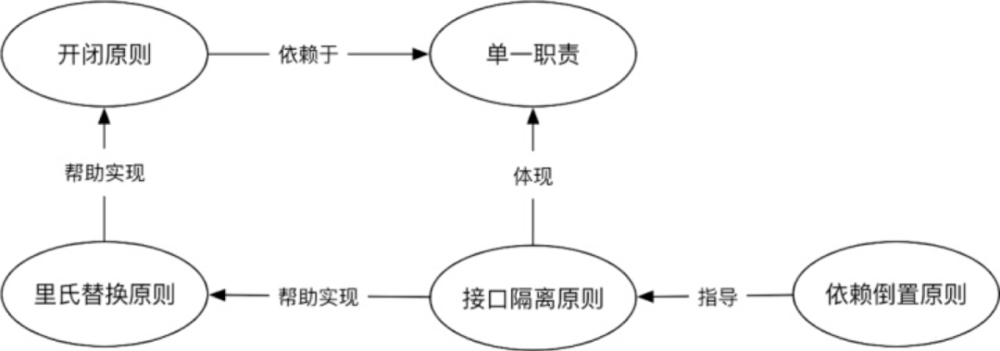
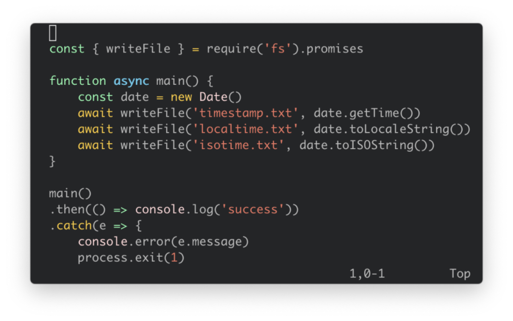
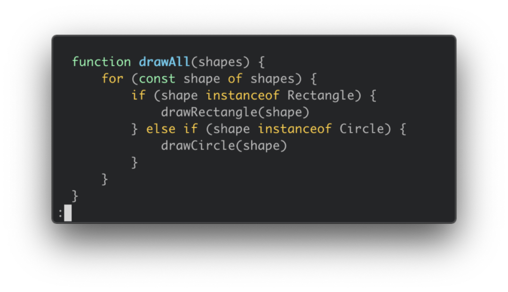
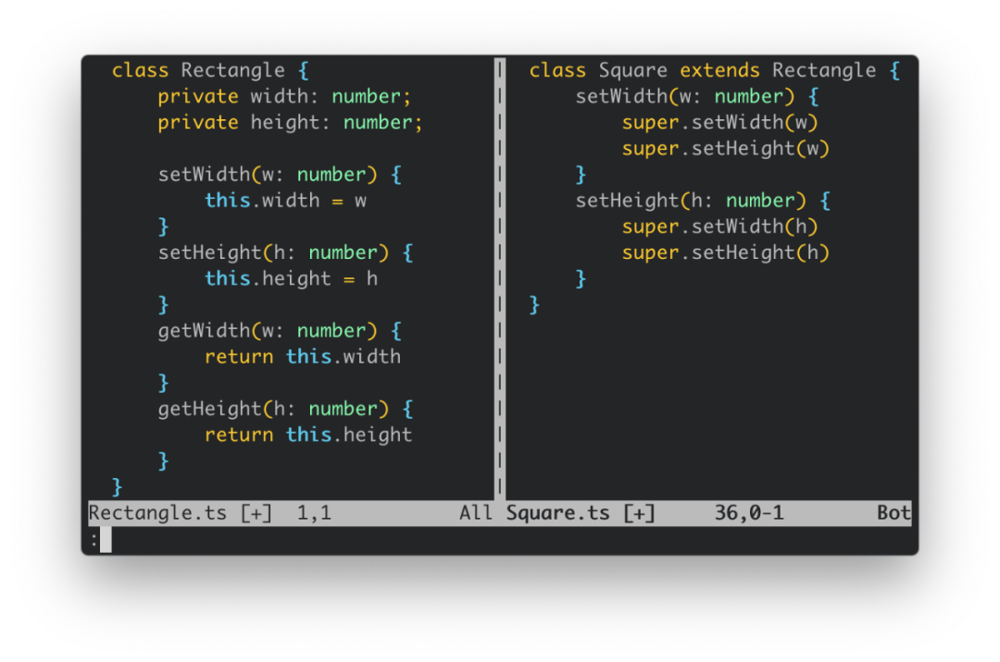
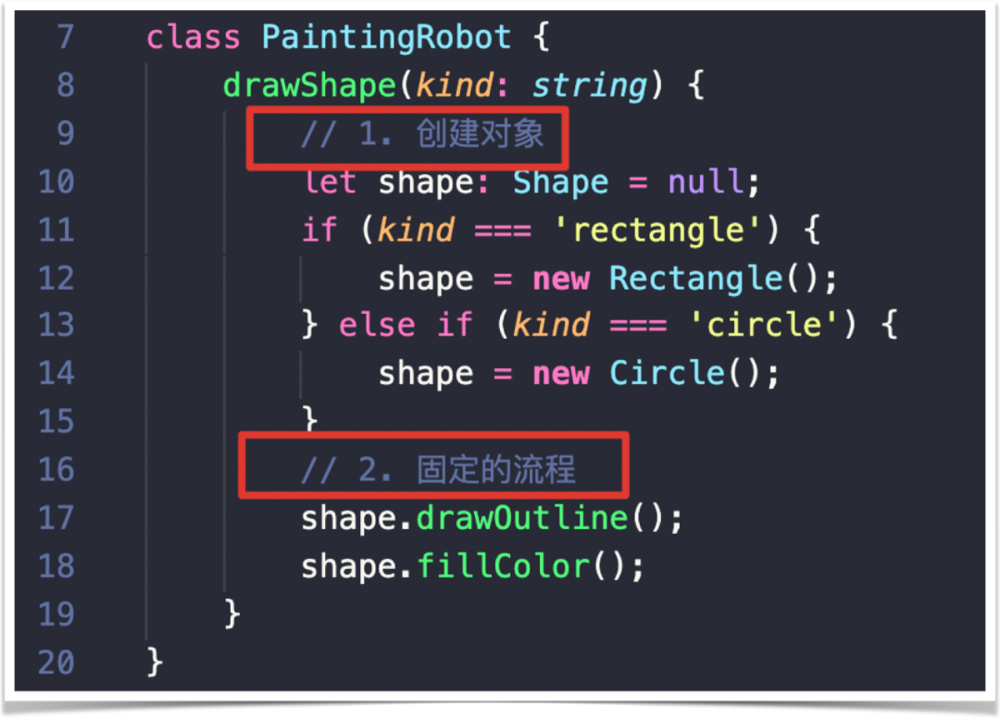
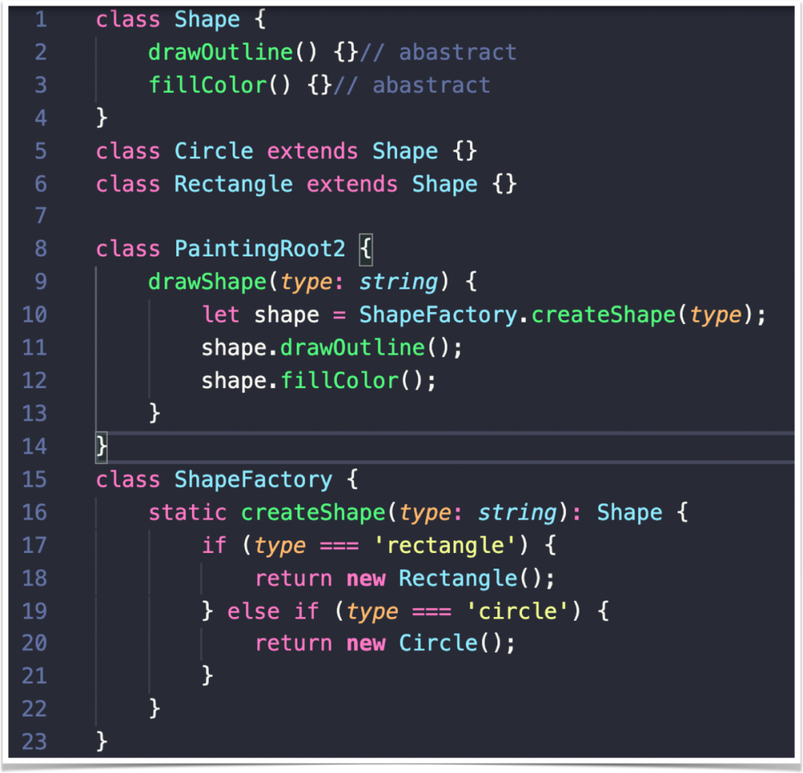

# 细说 SOLID 原则

> [原文地址](https://mp.weixin.qq.com/s/PwO4ymEKabk74a7J8lAhdg)

我们收到的简历中几乎所有人都声称`熟悉面向对象`，但很少人能够概括面向对象方法和原则，面向对象设计和过程式设计的关键区别在哪，以及怎么定义和衡量可读性、究竟什么是可复用性、怎样的代码称为脆弱和僵化的。

> 本文从`SOLID`原则出发，通过更贴近业务的解释性文字和具体的代码示例来回答这些问题。

## 什么是 SOLID？

在程序设计领域，`SOLID` 是由 `Robert C. Martin`（敏捷宣言作者之一，曾任敏捷联盟主席）在 21 世纪早期提出的便于记忆的首字母缩写，指代面向对象编程和面向对象设计的五个基本原则：`单一功能`、`开闭原则`、`里氏替换`、`接口隔离`以及`依赖反转`。在这一篇中我们只关注这些原则各自的定位和它们之间的关系。见下图：

概括地讲（下文会具体展开）：`单一职责是所有设计原则的基础，开闭原则是设计的终极目标`。

`里氏替换原则`强调的是子类替换父类后程序运行时的正确性，它用来帮助实现开闭原则。而`接口隔离原则`用来帮助实现里氏替换原则，同时它也体现了单一职责。`依赖倒置原则`是过程式设计与面向对象设计的分水岭，同时它也被用来指导接口隔离原则。

## 什么时候应该应用原则？

设计原则和设计模式都是经验的总结，方便分析和解决问题，但并不能用来判断是否存在问题。例如下面这段代码：

- 它违反了单一职责：这个`main`方法即获取了当前日期，又做了日期的处理，数据的写入。这个违反让它更难理解和维护了吗？

- 它违反了开闭原则：很显然这个逻辑并不是可扩展的，只能通过修改的方式去增加功能。这个违反让它更难修改了吗？

- 它违反了依赖倒置原则： `main` 函数直接依赖底层模块 `fs` 的 `writeFile` 方法，调用 `main` 时必须和 `fs` 模块绑定。这个绑定让它无法在其他 `fs` 实现里复用，但是会有这个需求吗？

对于一个负责日常工作的、功能不太会扩展的小脚本而言，这段代码是比较完美的。当我们不认为它维护困难时，就不应该对它套用各种原则和模式来把问题复杂化（或过度设计)。

当这段代码变得更复杂，我们发现它难以维护时，再去应用原则来诊断和分析问题。有这样的概念后，我们再来看具体的每项原则。

## 单一职责原则

> 内容：一个类只负责一件事，只有一个引起它变化的原因。

单一职责希望避免的问题很简单：避免修改一个地方反而引发另一个地方的问题。如果你的项目经常发生这样的问题，或你的 `QA` 同学经常有这样的质疑，那么应该抱着这个原则去重新审视你的业务逻辑。

此外当一个类（或一个函数）足够复杂时，它可读性、健壮性、可复用性一定会存在问题：

- 可读性差。无论是否有注释，谁都很难把握一个连续好几页的函数到底在做什么。

- 脆弱。在很难理解一个函数职责的情况下，更改其中的一部分很容易犯错。尤其在存在很多横贯整个函数的变量时，或者存在大量条件分支的情况。

- 难以复用。把多个职责包裹在一起就像打包销售一样，很少有其他场景恰好有需要完全一样的打包功能。

## 开闭原则

> 内容：软件中的对象（类，模块，函数等等）应该对于扩展是开放的，但是对于修改是封闭的。

笔者认为开闭原则是`SOLID`中最难理解的一项原则：如果一个类 / 函数对修改是封闭的，那么怎么扩展这个类的功能？这恰好是开闭原则要解决的问题，这个原则尝试去做到：`新增功能时，已有的业务代码可以几乎完全保持不变。`因为已有的类和函数都没有变更，因此我们才能有信心判断这次变更不会影响其他的功能，这样的设计才是健壮的。

应用单一职责只需要梳理和归纳，`而应用开闭原则的关键则在于抽象`。我们用一段代码示例来解释应用开闭原则的过程：

上述代码事实上没啥问题，但我们要把它想象成它要表达的有问题的代码，比如 shape 的类型不止两种，分支条件不止是 instanceof，每个条件下做的事情也不止一行。那么它就明显有问题了：

- 脆弱：如果需要新增一种`Shape`，我们必须继续更改这个函数，并继续新增条件语句。

- 僵化：如果需要新增一种 `Shape`（比如 `Triangle`），我们必须改很多份代码（参考反模式 散弹枪手术)，新增一个 `drawTriangle` 方法，再去 draw 函数里做相应的 import 和处理。

- 牢固： `drawAll` 依赖于 `Rectangle` 和 `Circle`，无法拿出来复用。可复用和可测试很多情况下都是同义词，比如为了测试 `drawAll` 我们需要把所有 `Shape` 代码都准备好，具体的 `Shape` 存在问题也会导致 `drawAll` 的单元测试失败，而且很难mock掉`drawAll`的依赖。

这时我们需要对 `drawAll` 的功能进行 “抽象”。比如我们发现 `drawAll` 其实并不关心 `shape` 的类型是 `Circle` 还是 `Rectangle`，只需要它能够 `draw`。因此我们让 `drawAll`、 `Circle`、 `Rectangle` 都依赖一个能够 `draw` 的 `Shape` 接口即可，解除 `drawAll` 对具体的 `Circle` 和 `Rectangle` 类型的依赖。重构后得到这样的代码：

上述代码是 `TypeScript` 实现，如果是 `JavaScript` 实现则 `drawAll`、 `Circle`、 `Rectangle` 都不再依赖 `Shape`。`JavaScript` 没有接口的概念，但这个约定仍然存在只是没有在源代码中显式地表达出来。我们称它为隐式接口，类似 `C++` 模板中体现的隐式类型，只不过它是编译期检查，`JavaScript` 的隐式接口直接产生运行时错误。

注意应用开闭原则进行重构对上述代码产生的影响：

- 因为我们从 `drawAll` 里干掉了条件分支，这份代码不再脆弱。

- 也不再僵化，因为需要新增类型时我们只需要新增一个 `Triangle` 类，不需要对 `drawAll` 引入变更。

- 也不再牢固，因为 `drawAll` 不再依赖任何具体的类，它的单元测试和复用也更容易。

设计是一种权衡的艺术，让某些事情变好的同时也让另外一些事情变坏了。思考： `drawAll` 在重构前后灵活性变好了还是变坏了？欢迎留下你的评论。

## 里氏替换原则

> 内容：若对每个类型 `S` 的对象 `o1`，都存在一个类型 `T` 的对象 `o2`，使得在所有针对 `T` 编写的程序 `P` 中，使用 `o1` 替换 `o2` 后，程序 `P` 行为功能不变，则 S 是 T 的子类型。

如上是通过 “子类型” 的定义来描述里氏替换原则的，也可以用对子类型的要求来描述：`子类型（subtype）必须能够替换掉它们的基类型（basetype）同时程序的功能保持不变。`因此里氏替换原则可以确保新增的子类型不会影响基于父类型编写的代码，也就是说里氏替换原则是用来实现开闭原则的。这是一个很简单的原则，但实现起来却很 tricky。比如我们有一个 Rectangle 类，突然有一天需要一个 Square：

我们让 `Square` 继承自 `Rectangle` 是有理论依据的：正方形是一种长方形。但是这一继承潜在地破坏了既有的使用方代码，因此违反了开闭原则：

这段既有代码会在新的 `Square` 上出错，所以是哪里出了问题？因为几何学上的 "is a" 关系和面向对象的 "is a" 关系是不同的。面向对象的 "is a" 是关于行为的：一个对象是另一个对象的子类型时，它应该拥有所有父类的行为（方法）和属性。

这里的 `setHeight` 和 `setWidth` 的行为确实发生了变化，因为在设置长方形宽的时候，没人会想到它的高会发生变化。

这个 case 可以引申出另一个结论：模型的正确性不是内在的。一个模型，如果孤立地看，不具有真正意义上的正确性，它的正确性只能通过它的客户程序来体现。也就是说一个类 / 函数允许的使用方式，它的文档和单元测试，决定了它正确性，而不是代码实现本身是否自洽。为了让二者更加靠近，需要采用类似 防御性编程 的手段。

## 接口隔离原则

> 内容：不应该强制客户代码依赖它不需要的方法。

由于 JavaScript 没有接口的概念，接口在前端开发中很少接触，需要接口的地方都用文档来定义一个 “隐式接口”（比如各种库的 options 结构），无法在编译期检查只能在运行时抛出乱七八糟的错误。但随着 `TypeScript` 的普及和 `DefinitelyTyped` 的努力，接口也在逐渐进入前端。

类似里氏替换原则，接口隔离原则是为了帮助实现开闭原则，它的思想也体现了单一职责原则。设想有一款实现了打印、扫描、传真、复印 4 个功能的打印机 `PrinterA`，它是一个具体的类。我们为这个类定义一个打印机接口 `IPrinter`，这个接口也同样有打印、扫描、传真、复印 4 个方法。

- 第一个问题出在我们出现一个不支持传真的打印机 `PrinterB` 的时候：`PrinterB` 不支持传真接口，但是要实现 IPrinter 接口就必须实现一个假的，会抛错的传真方法。这样做的问题在于错误从编译期跑到了运行时。

- 第二个问题出在我们给 `PrinterA` 新增方法（比如双面打印）的时候：我们需要把所有实现了 `IPrinter` 的打印机（包括 `PrinterB`）都新增对应方法。显然违反了开闭原则。

那么让所有 `Printer` 继承自一个提供缺省实现的公共父类呢？这又违反了里氏替换原则（明显子类和父类的行为是不同的），同时也把错误从编译期延迟到了运行时。

应用接口隔离原则的方法也很直观：把 `IPrinter` 拆分成若干职责单一的小接口，比如 `ICopy`，`IFax`，`IPrint`。然后具体的 `PrinterA`、`PrinterB` 实现自己需要的那些接口。这样使用 `PrinterB` 上不支持的传真方法时，就可以在编译期抛出错误；由于不需要再提供缺省方法，修改 `PrinterA` 也不会导致 `PrinterB` 的变更，也不再需要一个公共父类了。

## 依赖倒置原则

> 内容：高层模块不应该依赖底层模块，两者都应该依赖抽象；抽象不应该依赖细节，细节应该依赖抽象。

在业务代码的开发中，经常会发现一个现象：底层模块通常更容易被复用，也更容易写单元测试，高层模块很难被复用，也更难测试。这就是依赖倒置原则要解决的问题，高层代码和底层代码应当同样地可复用，同样地可测试。

和单一职责原则、开闭原则一样，应用依赖倒置的关键还是在于 “抽象” 和 “归纳”。分析不变的部分（高层的、抽象的逻辑），和容易变的部分（底层的、细节的逻辑），把相对稳定的高层逻辑加以抽象，让它不再依赖于具体的底层逻辑。比如下面例子中的 PaintingRobot 的 drawShape 用来创建和绘制一个具体的图形：

可以看到高层的逻辑包括两个步骤：

1. 创建对象，

2. 固定的绘制流程。

而 `drawShape` 依赖于具体的 `Shape` 比如 `Circle`, `Rectangle`，为了解除这个依赖，我们把这两个过程加以抽象：

1. 创建过程封装到一个工厂类中；

2. 绘制流程抽象到 Shape 接口。

3. 重构后可以得到如下的代码：

得到的新的代码中，新增一个具体 `Shape` 时不再需要变更 `drawShape` 方法，因此符合了开闭原则。另外 `PaintingRobot` 类也不再依赖于 `Circle` 和 `Rectangle`，使得 `PaintingRobot` 更容易复用和单元测试。注意这个过程中依赖关系的变化：

另一个角度看，依赖倒置是面向过程设计和面向对象设计的关键区别。体现在思考问题的方式倒置了：

- 在面向过程设计中，先确定流程是 “Robot 类创建形状 -> 根据条件创建不同形状类 -> 执行后续流程”，再确定其中每一步的实现方式；

- 在面向对象设计中，先考虑 “存在不同的 Shape，对使用方来讲，它们有怎样的共同抽象”，再提供可用的 Shape 接口交给使用方，而具体的 Shape 类可以并行地开发。因此依赖倒置原则也是面向接口编程的基础。

## 总结

- 单一职责原则是 SOLID 所有原则的基础和解决问题的思路。

- 开闭原则是直接保障代码质量的原则，用来解决设计的脆弱性、僵化、难以阅读、难以复用等问题，应用开闭原则的关键在于如何 “抽象”。

- 里氏替换原则通过确保子类和父类是 "is a" 的关系，来帮助实现开闭原则。该原则的使用中，引申出面向对象角度的 "is a" 是关于行为的，以及模型的正确性不是内在的，而是由它的客户程序来体现。

- 接口隔离原则提供了一种方案，在不违反里氏替换原则的情况下，如何实现开闭原则。同时接口隔离的思想本身也体现了单一职责原则。

- 依赖倒置原则是过程式设计与面向对象设计的分水岭，通过适当的抽象，让高层模块和底层模块同样地可复用和可测试。同时它也被用来指导接口隔离原则