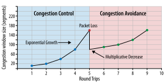
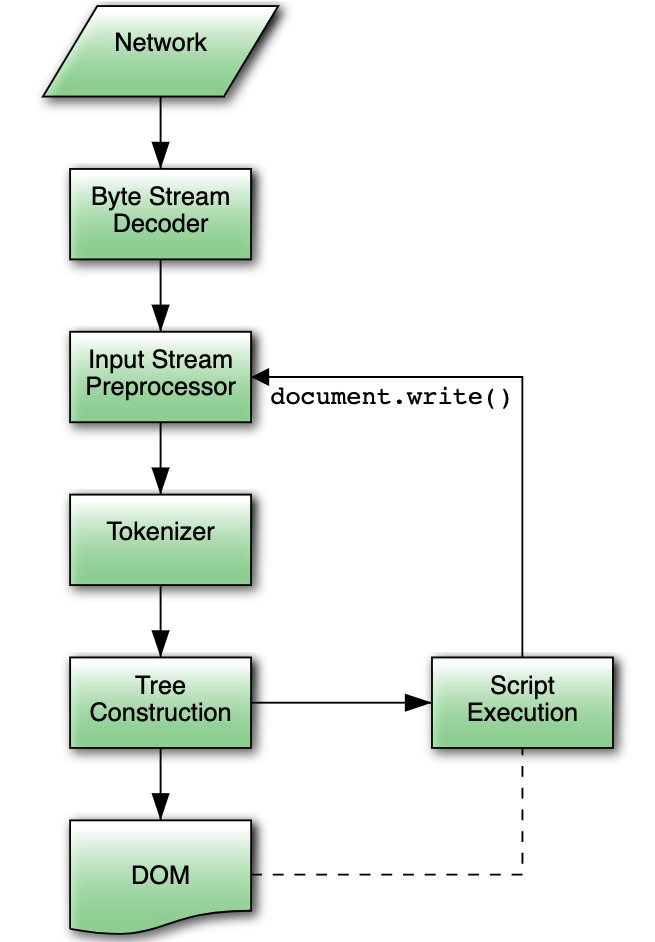
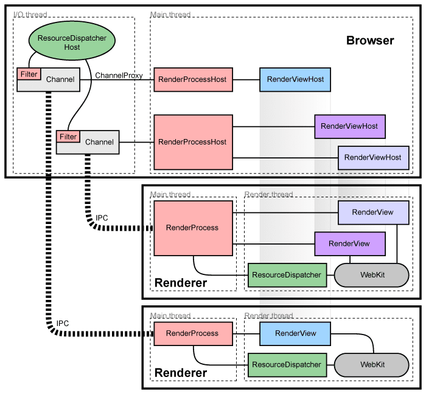

# 从URL到页面呈现

30年前第一个网页上线，那时候人们对于因特网还非常陌生，网上冲浪更无从谈起，而如今各式各样的网站为我们提供了丰富多彩的资讯和娱乐。那么对于网页背后的功臣-浏览器是如何工作的呢？或者说它是如何呈现网页的呢？

## 资源获取说起

当我们在浏览器的地址栏中输入要访问的域名，这个故事就开始了....

> https://www.baidu.com

### 强制缓存的查找

关于浏览器的强制缓存，我在[Http 缓存](https://github.com/superTerrorist/Blog/issues/33#http-cache)已有比较详尽的解析

### DNS 查找

> [DNS 原理入门](http://www.ruanyifeng.com/blog/2016/06/dns.html)

### 建立TCP连接

通过DNS查找到对应IP地址后，下一步就是建立TCP连接，TCP连接有几个重要的概念

#### 三次握手

> 在正式发送数据包前，会进行三次握手，以确保连接可靠，具体过程如下：
>
> 1. 客户端向服务端发送一个数据包； 
> 2. 服务端接收到包后向客户端发送数据包（表明自己接受能力正常）； 
> 3. 客户端收到数据包后再向服务端发送确认包（表明客户端接收能力正常）

#### TCP慢启动

在完成三次握手后，发送端和接受端就建立了TCP连接。但是在连接建立之初，由于并不清楚带宽的情况，并不能够马上发送大量的数据包（可能会导致路由器缓存空间耗尽），而是采用了**慢启动**的方式，先发送少量的包（14kb）,而后根据带宽情况进行调整



#### 四次挥手

> 在断开连接前，会进行四次挥手。
>
> 客户端和服务端都可以发送连接断开的请求，一开始服务端和客户端都处于`ESTABLISHED`的状态。
>
> 1. 而后客户端向服务端表示自己要断开连接（服务端向客户端也可以）；
> 2. 服务端在接受到客户端的报文后，向客户端发送确认报文
> 3. 但是此时客户端和服务端还没有正式的断开，服务端可能还有些数据需要传送给客户端，在数据全部传送完毕后，服务端会向客户端发送连接释放报文； 
> 4. 客户端收到服务器的连接释放报文后，发出确认报文

## 资源的解析和渲染

完成了网络请求和响应后，浏览器就需要对所获得的资源进行解析，通常这需要五大步骤（CRP）：创建DOM树、CSS DOM、生成Render Tree、Layout和Paint

> [Critical Render Path](https://developers.google.com/web/fundamentals/performance/critical-rendering-path)

### DOM Tree



1. 资源获取（from network or local file system） 

2. 我们从网络或本地文件资源中拿到的是字节流，拿到字节流后浏览器会尝试解码

   > 选定编码的规则：
   >
   > 1. 根据http头部字段conten-type获取字符编码 ```content-tyep: text/html;charset=utf-8```
   > 2. 根据文档的meta标签获取，例：```<meta charset="UTF-8" / >```
   > 3. 如果上述两个都没有，浏览器会通过[字节编码嗅探算法](https://html.spec.whatwg.org/multipage/parsing.html#encoding-sniffing-algorithm)决定字符编码

3. Input Stream Preprocessor: 这个步骤执行的做的事情仅仅是**标准化换行符**，因为在不同系统下使用文本使用的换行符是不一致的，**例如Windows使用CRLF作为换行符，而类Unix系统使用LF作为换行符**。

4. Tokenizer：字节流经过解码后形成了一串无状态的字符串，为了方便解析，需要将这一长串的字符串按规则分隔成一系列的子串。这个这个过程叫做`Tokenizer`(令牌化)

   > 令牌化的目的就是把之前无意义的字符串分隔成单词组成的句子，比如`iamacoder`这一串字符串没有任何意义，但是如果我们把它分割一下`i` `am` `a` `coder`就组成了有意义的句子，令牌化的目的也在于此

5. DOM: 字符经过`Tokenizer`会传递给`Tree Construction`输出`Dom Tree`

### CSS DOM

在浏览器解析`html`时，如果遇到`link`标签，它会立即发送对该资源的请求，但它不会阻塞Dom的生成。

与处理 HTML 时一样，浏览器会将获取的字节转化成类似于`DOM`的`CSSOM`


### Render Tree

CSSOM + DOM = Render Tree


为了构建渲染树，浏览器需要完成以下几个工作：

1. 从 DOM 树的根节点开始遍历每个可见节点
   - 某些节点不可见（例如脚本标记、元标记等），因为它们不会体现在渲染输出中，所以会被忽略。
   - 某些节点通过 CSS 隐藏，因此在渲染树中也会被忽略，
2. 对于每个可见节点，为其找到适配的 CSSOM 规则并应用它们

> 请注意 `visibility: hidden` 与 `display: none` 是不一样的。前者隐藏元素，但元素仍占据着布局空间（即将其渲染成一个空框），而后者 (`display: none`) 将元素从渲染树中完全移除，元素既不可见，也不是布局的组成部分

### Layout

渲染树为我们提供了节点以及每个节点对应的样式规则，基于这些信息我们可以计算出每个节点的大小和位置。这就是Layout这一步所做的事情，确定每个节点的位置和大小。

### Paint

布局完成后，浏览器需要将这些信息输出到屏幕中


## 阻塞和非阻塞资源

在前面`资源的解析和渲染`中，我们可以知道:

1. `CSS`资源虽然不会阻塞`DOM`树的生成，但是会阻塞`Render Tree`
2. `JS`资源不仅仅会阻塞`DOM`树的生成而且也会影响`CSS DOM`，理由很简单因为JS会修改dom和css
3. 而图片和字体等是非阻塞资源

知道结论后，为了优化网页的加载速度，我们就要思考如何延迟加载非关键的`CSS`和`JS`资源

### JS的加载优化

1. 懒加载

2. 利用`script`中的属性

   > [`<script> async, defer, async defer, module, nomodule, src, inline` - the cheat sheet](https://gist.github.com/jakub-g/385ee6b41085303a53ad92c7c8afd7a6)


### CSS的加载优化

1. 使用媒体查询，减少样式的解析量

```html
<link href="style.css"    rel="stylesheet">
<link href="style.css"    rel="stylesheet" media="all">
<link href="portrait.css" rel="stylesheet" media="orientation:portrait">
<link href="print.css"    rel="stylesheet" media="print">
```

虽然上面的样式都会被下载，但只有符合调整的样式才会被解析

## 重绘和回流

### 重绘（repaint）

当元素的某些属性发生变化，这些属性又只影响元素的**外观和风格**，而不改变元素的布局、大小（比如颜色、背景），浏览器会重新绘制新的样式，这个过程称之为重绘。


### 回流（reflow）

当元素的布局、大小规模和显示方式发生改变时，触发的浏览器行为叫回流。

>  注意：回流必将引起重绘，而重绘不一定伴随回流。同时，回流对性能的影响要大于重构。

**会导致回流的操作**：

- 页面首次渲染
- 浏览器窗口大小发生改变
- 元素尺寸或位置发生改变
- 元素内容变化（文字数量或图片大小等等）
- 元素字体大小变化
- 添加或者删除**可见**的`DOM`元素
- 激活`CSS`伪类（例如：`:hover`）
- 查询某些属性或调用某些方法

**一些常用且会导致回流的属性和方法**：

- `clientWidth`、`clientHeight`、`clientTop`、`clientLeft`
- `offsetWidth`、`offsetHeight`、`offsetTop`、`offsetLeft`
- `scrollWidth`、`scrollHeight`、`scrollTop`、`scrollLeft`
- `scrollIntoView()`、`scrollIntoViewIfNeeded()`
- `getComputedStyle()`
- `getBoundingClientRect()`
- `scrollTo()`

### 如何避免

#### CSS

> [Css triggers](https://csstriggers.com/)

- 避免使用`table`布局。
- 尽可能在`DOM`树的最末端改变`class`。
- 避免设置多层内联样式。
- 将动画效果应用到`position`属性为`absolute`或`fixed`的元素上。
- 避免使用`CSS`表达式（例如：`calc()`）。

#### JavaScript

- 避免频繁操作样式，最好一次性重写`style`属性，或者将样式列表定义为`class`并一次性更改`class`属性。
- 避免频繁操作`DOM`，创建一个`documentFragment`，在它上面应用所有`DOM操作`，最后再把它添加到文档中。
- 也可以先为元素设置`display: none`，操作结束后再把它显示出来。因为在`display`属性为`none`的元素上进行的`DOM`操作不会引发回流和重绘。
- 避免频繁读取会引发回流/重绘的属性，如果确实需要多次使用，就用一个变量缓存起来。
- 对具有复杂动画的元素使用绝对定位，使它脱离文档流，否则会引起父元素及后续元素频繁回流。

## 浏览器架构

> [Multi-process Architecture](https://www.chromium.org/developers/design-documents/multi-process-architecture)



浏览器是多进程的，这样可以避免由于一个进程的崩溃导致整个浏览器的宕机

由上图我们有两类进程：`Browser`和`Render`，`Browser`主要负责管理UI、tab以及浏览器插件，而每个新建的Tab都有对应的一个`Render`进程

## 参考

1. [Building Blocks of TCP](https://hpbn.co/building-blocks-of-tcp/)
2. [Populating the page: how browsers work](https://developer.mozilla.org/en-US/docs/Web/Performance/How_browsers_work)
3. [Google Doc: Critical Render Path](https://developers.google.com/web/fundamentals/performance/critical-rendering-path)
4. [JavaScript modules](https://v8.dev/features/modules#module-vs-script)
5. [浏览器的回流与重绘 (Reflow & Repaint)]()
6. [Css triggers](https://csstriggers.com/)
7. [Google Demo](https://googlechrome.github.io/devtools-samples/jank/)

