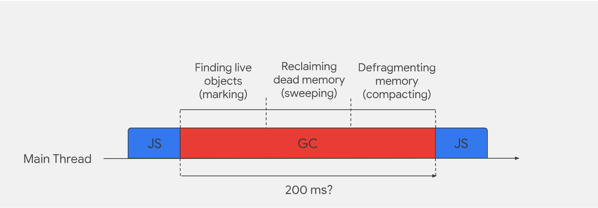
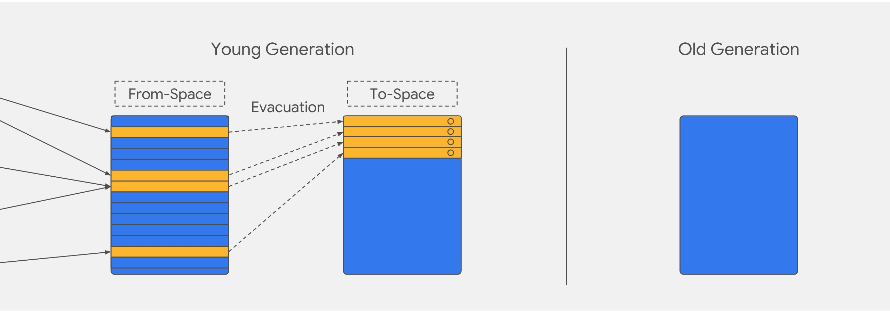
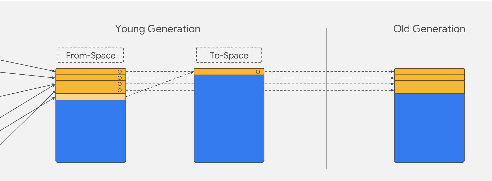

# V8垃圾回收机制探秘

Javascript以其灵活轻便而被人称道，其中一个重要的特性就是不需要手动进行内存分配和收集，这一切都交给V8这类的虚拟机来完成。今天，我们就来简要的探讨一下V8内存回收的机制。

## V8内存限制

默认情况下，对于32位系统，V8最多分配`0.7G`内存，64位系统而言，内存上限是`1.4G`。

V8限制内存的原因，表面上是因为浏览器处理大内存的场景较少，所分配内存绰绰有余，更深层次的原因在于垃圾回收的限制。V8官方的说法：

> 以 1.5GB 的垃圾回收堆内存为例，V8 做一次小的垃圾回收需要50ms 以上，做一次非增量式的垃圾回收甚至要 1s 以上。

垃圾回收会占用主线程，导致其他任务暂停，垃圾回收的时间过长就会导致页面卡顿影响体验。

不过，如果你是node应用可以通过配置来调整内存大小：

```bash 
# 调整老生代内存 单位MB
node --max-old-space-size=2048 xxx.js 
```

```bash
# 调整新生代内存 单位MB
node --max-new-space-size=2048 xxx.js
```

## V8垃圾回收机制

V8垃圾回收通常需要三个步骤：`标记（marking）`、`清除（sweeping）`和`整理（compacting）`。



1. 标记（marking）

垃圾回收器通过`可访问性（reachability）`来确定对象是否可以被回收。具体的讲，垃圾回收器通过遍历`GC Root`，把所有可访问到的对象标记为`活动对象`，把其他没有被遍历到的对象标记为`非活动对象`。

在浏览器环境中，`GC Root` 通常包括了以下几种（包括但不限于）：

- 全局`Window`对象
- 文档`DOM`树，由可以通过遍历文档到达的所有原生`DOM`节点组成
- 存放栈上变量

2. 清除（sweeping）

这一阶段就是将被标记为`非活动`的对象清除，达到释放内存的目的。

3. 整理（compacting）

一般来说，频繁回收对象后，内存中就会存在大量不连续空间，我们把这些不连续的内存空间称为`内存碎片`。当内存中出现了大量的内存碎片之后，如果需要分配较大的连续内存时，就有可能出现内存不足的情况，所以最后一步需要整理这些内存碎片。但这步其实是可选的，因为有的垃圾回收器不会产生内存碎片，比如接下来我们要介绍的副垃圾回收器。

目前，V8主要采用来两个垃圾回收器：

- `主垃圾回收器(Major GC)`，负责老生代的垃圾回收
- `副垃圾回收器(Minor GC - Scavenger)`，负责新生代的垃圾回收

V8之所以把内存分割成`新生代`和`老生代`两个区域，主要是基于`“代际假说”（The Generational Hypothesis）`。代际假说表明很多对象在内存中存在的时间是很短的。所以在V8中使用`新生代`来存储较短生命周期的对象，用`老生代`来存储生存时间久的对象。

### 副垃圾回收器

副垃圾回收器负责`新生代`中的垃圾回收工作，幸存的对象会先被分配到`新生代`。

新生代中的垃圾数据用`Scavenge`算法来处理。所谓`Scavenge`算法，是把新生代空间对半划分为两个区域，一半是对象区域 `From-Space`，一半是空闲区域 `To-Space`，如下图所示：


新加入的对象都会优先存放在对象区，当对象区的空间不足时，就需要执行一次垃圾回收操作。

在垃圾回收过程中，首先标记对象区（`From-Space`）中的活动对象，并将这些活动对象复制到空闲区（`To-Space`），完成复制之后，将这两块内存空间互换，即把`To-Space`变成`From-Space`，把`From-Space`变成`To-Space`。一旦垃圾回收完成，新分配的内存空间将从`From-Space`下一个空闲内存地址开始。

> 这样做的好处是可以保证内存的连续性



但毕竟`新生代`的内存空间有限，又被划分成两块，如果仅仅依靠上面的策略，我们很快就会耗尽内存空间。为了新生代的内存空间不被耗尽，<b>副垃圾回收器还会采用对象晋升策略，也就是移动那些经过两次垃圾回收依然还存活的对象到老生代中</b>。



### 主垃圾回收器

主垃圾回收器主要负责`老生代`的垃圾回收工作，由于`老生代`内存放的对象一般占用的空间比较大，如果采用与`新生代`相同的算法，复制这些对象所耗费的时间可能比较大，导致运行效率不高。所以，主垃圾回收器采用`标记-清除（Mark-Sweep）`和`标记-整理 (Mark-Compact）`来处理内存。

- 标记-清除（Mark-Sweep）

主垃圾回收器会从一组根元素开始，将所有不能访问的对象标记为非活动对象，并进行清理

- 标记-整理 (Mark-Compact）

`标记-清除`的算法虽然释放来部分空闲内存，但多次执行该算法会导致大量的内存碎片，从而引发内存不足的问题。所以主垃圾回收器又引入了另外一种算法——`标记-整理（Mark-Compact）`。`Mark-Compact`在标记完存活对象以后，会将活着的对象向内存空间的一端移动，移动完成后，直接清理掉边界外的所有内存。

在V8的回收策略中，`Mark-Sweep`和`Mark-Conpact`两者是结合使用的。

由于`Mark-Conpact`需要移动对象，所以它的执行速度不可能很快，在取舍上，V8主要使用`Mark-Sweep`，在空间不足以对从新生代中晋升过来的对象进行分配时，才使用`Mark-Compact`。

## 常见内存问题

1. 内存泄露

> 内存泄漏（Memory Leak）是指程序中已动态分配的堆内存由于某种原因程序未释放或无法释放，造成系统内存的浪费，导致程序运行速度减慢甚至系统崩溃等严重后果

内存泄露是一个积累的过程，频繁交互会加快累积过程。如果页面发生卡顿、或者在操作过程突然刷新（Safari）、或者浏览器崩溃出现（chrome 会出现“Aw,Snap”），那我们应该首先想到是否发生内存泄露。

可能导致内存的泄露的情况：

- 全局变量： 比如缓存，无限增长不加限制的缓存会导致内存泄露
- 事件监听未被移除：DOM已经移除，但事件并未移除
- 被遗忘的timer：`setTimeout`和`setInterval`
- 闭包

2. 内存膨胀/内存溢出

3. 频繁的垃圾回收

频繁的垃圾收集会造成页面卡顿，影响体验。频繁垃圾回收的原因可能是频繁使用大的临时变量，导致了新生代空间很快被装满。

## 参考

- 深入浅出NodeJs
- [图解 Google V8](https://time.geekbang.org/column/article/230845?utm_source=related_read&utm_medium=article&utm_term=related_read)
- [Trash talk: the Orinoco garbage collector](https://v8.dev/blog/trash-talk) Google官方出品，对应翻译版本：[翻译版](https://fenews.org/posts/the-Orinoco-garbage-collector/)
- [JS内存泄漏排查方法](http://www.ayqy.net/blog/js%E5%86%85%E5%AD%98%E6%B3%84%E6%BC%8F%E6%8E%92%E6%9F%A5%E6%96%B9%E6%B3%95/)
- [携程桌面应用的前端内存优化与监控](https://zhuanlan.zhihu.com/p/214051786)
