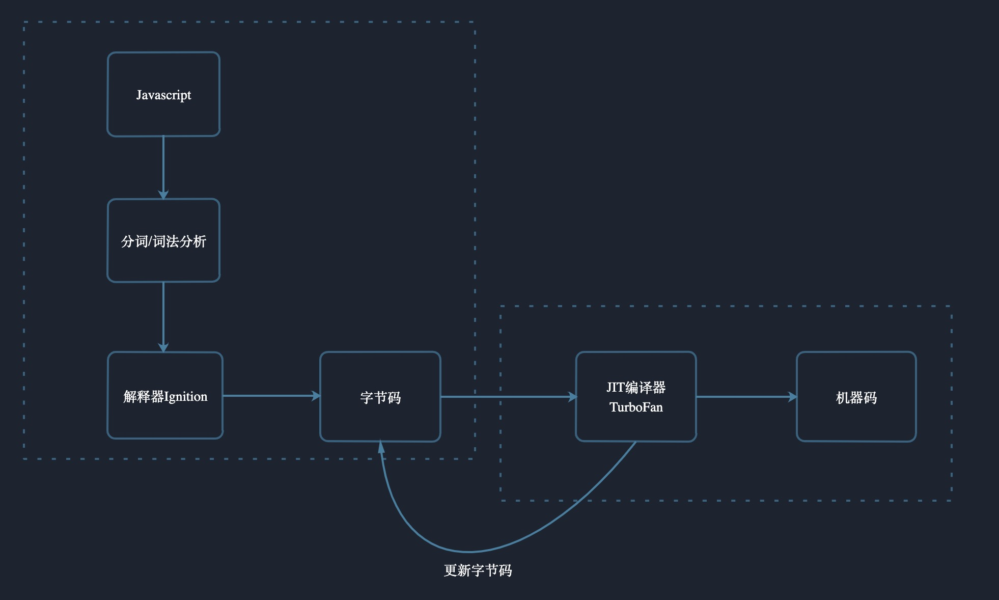
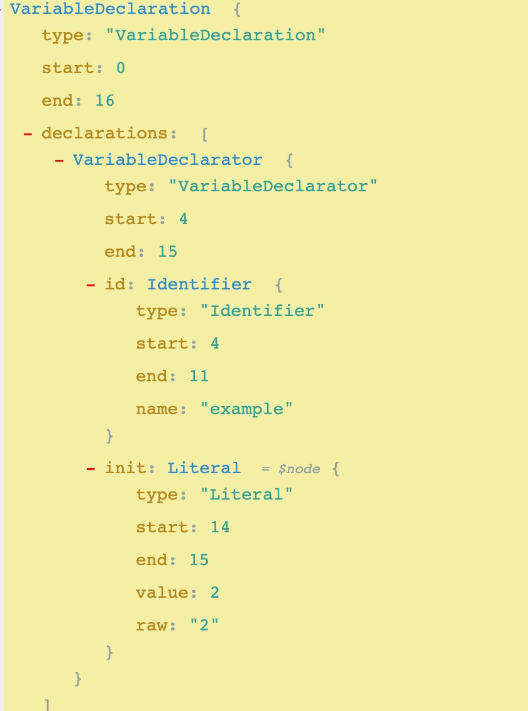

# V8 是如何执行Js代码的

这几年来，前端发展日新月异，各种工具、框架层出不穷，要想跟上节奏，一味的学习新的框架和工具是远远不够的，还需要我们沉下心来从基础学起。今天，我们就来探讨一下，关于V8是如何执行Js代码的。

V8相信前端同学都不会陌生，它是Google出品的Js引擎，以性能著称，也被Node集成，那一段Js代码是如何在V8中被解析执行的呢？话不多说，直接上图：



## 分词和词法分析

这个过程会将一行行的源码拆解成一个个 token。举个例子：

```js 
var example = 2;
```

那么这段程序将被拆分成以下几个Token: `var`、`example`、`=`以及`2`，拆分token的目的主要是为了下一步AST做准备。

## 构建抽象语法树（AST）

所谓的AST，我们可以把它理解为代码的结构化的表示，还是沿用上面的例子，使用[AST 转换工具AST Explorer](https://astexplorer.net/)，我们可以看到如下结构：



AST是非常重要的一种数据结构，在很多项目中都有使用，比如Babel、ESLint等这些都是现将代码转化成AST，再对其进行转化或者检查的。

## 生成字节码

接下来V8会通过解析器Ignition生成对应的字节码，那什么是字节码呢？


字节码是生成机器码过程中的一个中间产物，机器码是计算机可以识别并运行的，而字节码需要通过对应的转换器转化为机器码后才能执行。

那或许有人会有这样的疑问：为什么不直接转化成机器码而要生成一个过度产物呢？

其实一开始V8并没有字节码，而是直接将AST转换为机器码。但由于机器码相较于字节码占用的内存更多等原因，舍弃了这个方案。具体原因[V8 Ignition：JS 引擎与字节码的不解之缘](https://zhuanlan.zhihu.com/p/26669846)讲的很清楚了，有兴趣的同学可以看看。


## JIT 编译器

字节码生成以后，JIT 编译器TurboFan就粉墨登场了，编译器的主要作用有两个：

- 优化字节码的内容并更新字节码缓存

代码运行时，编译器会分析有哪些代码是可以被优化的，比如，一个`for`循环跑了 100 次，但是每次迭代产生的结果都是一样的。如果代码存在优化点，那么编辑器就会将优化后的字节码替换到对应的缓存中，随着字节码的不断优化，Js的执行效率将不断提高。

- 将字节码转化成对应的机器码

将字节码转化成机器码是编译器的重要使命之一，但并不每一次编译器都要执行字节码。

如果一段程序是第一次被调用，那么编译器会按常规步骤执行字节码生成机器码，但如果这段程序已经被重复执行了（我们将这段代码称之为热点代码），那么编译器就会把该段热点的字节码编译为高效的机器码，然后当再次执行这段被优化的代码时，只需要执行编译后的机器码就可以了，这样就大大提升了代码的执行效率。

## 参考

- [How Does JavaScript Really Work](https://blog.bitsrc.io/how-does-javascript-really-work-part-1-7681dd54a36d)
- [Understanding V8’s Bytecode](https://medium.com/dailyjs/understanding-v8s-bytecode-317d46c94775)
- [V8 Ignition：JS 引擎与字节码的不解之缘](https://zhuanlan.zhihu.com/p/26669846)
