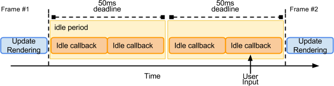

# `requestIdleCallback` 和 `requestAnimationFrame`

## `requestAnimationFrame`

> [requestAnimationFrame 执行机制探索](https://mp.weixin.qq.com/s/ocFcBRjj8xzizF5ebFepdA)

通过调用`window.requestAnimationFrame(callback)`可以确保浏览器在下次**重绘之前调用指定的回调函数**

```js
function animate(){
  // do something
	window.requestAnimationFrame(animate);
}
window.requestAnimationFrame(animate);
```


一般情况下，回调每秒被执行60次(60fps)，当然这取决于主线程的繁忙程度，假设某次执行了耗时任务，那么相应的fps也会被拉低。

> 流程的动画要求每秒60帧，也就是每帧执行的时间不超过`1000ms / 60 = 16.666ms`

### 使用场景

1. 通常用于连续动画，确保动画不卡顿

## `requestIdleCallback`

某些情况下，我们可能需要计算一些不需要立即呈现或者根本就不需要交换的内容，比如上报统计数据，内容的预加载等等。我们希望执行这些任务的时候能够尽量的不抢占主线程的资源，最好在浏览器“空闲时”执行。

在`requestIdleCallback`出现以前这样的需求无法被满足，`setTimeout`、`setInterval`虽然可以做到延时的效果，但是无法确保浏览器是在执行完其他相对优先任务后，利用空闲的时间运行回调。

`requestIdleCallback`提供了这一可能。

```js
const idleCallback = (deadline)=>{
    // deadline.timeRemaining()
    if(deadline.timeRemaining() > 5){
      // do something
    }
    window.requestIdleCallback(idleCallback);
};

window.requestIdleCallback(idleCallback)
```

通过`requestIdleCallback`指定的回调会在浏览器空闲时执行，而所谓的空闲是指**两个帧之间的空闲间隔**。


比如在执行连续动画的场景中，可能执行完一帧后的时间小于`16.6ms`,那么此时空余时间就是`16.6ms -实际运行时间 `。

在另外一些场景中，可能间隔很久才有用户操作，此时`deadline.timeRemaining()`会被限制在50ms，也就是这段空闲时间会被分割成多个执行。



> **为什么最大是50ms**？人类对100ms内的响应会认为是瞬时的。将空闲时间限制在50ms以内，是为了避免，空闲时间内执行任务，从而导致了对用户操作响应的阻塞，使用户感到明显的响应滞后。

### 使用场景

1. 用于非及时任务的计算和处理

#### `requestIdleCallback`里面可以执行DOM修改操作吗？

> 该建议来自：https://gitlwz.github.io/2019/04/03/js-requestIdleCallback/

强烈建议不要，从上面一帧的构成里面可以看到，`requestIdleCallback`回调的执行说明前面的工作（包括样式变更以及布局计算）都已完成。如果我们在callback里面做`DOM`修改的话，之前所做的布局计算都会失效，而且如果下一帧里有获取布局（如`getBoundingClientRect`、`clientWidth`）等操作的话，浏览器就不得不执行强制重排工作,这会极大的影响性能，另外由于修改dom操作的时间是不可预测的，因此很容易超出当前帧空闲时间的阈值，故而不推荐这么做。推荐的做法是在`requestAnimationFrame`里面做dom的修改，可以在`requestIdleCallback`里面构建`Document Fragment`，然后在下一帧的`requestAnimationFrame`里面应用Fragment。

除了不推荐DOM修改操作外，`Promise的resolve(reject)`操作也不建议放在里面，因为`Promise`的回调会在idle的回调执行完成后立刻执行，会拉长当前帧的耗时，所以不推荐。

推荐放在`requestIdleCallback`里面的应该是小块的（microTask）并且可预测时间的任务。

### 兼容情况


## 参考

- [Window.requestAnimationFrame()](https://developer.mozilla.org/en-US/docs/Web/API/window/requestAnimationFrame)
- [Using requestIdleCallback](https://developers.google.com/web/updates/2015/08/using-requestidlecallback)
- [HTML Standard系列：Event loop、requestIdleCallback 和 requestAnimationFrame](https://juejin.im/post/5ddf935951882530bd52bc8d)
- [你应该知道的requestIdleCallback](https://gitlwz.github.io/2019/04/03/js-requestIdleCallback/)
- [W3C requestIdleCallback规范](https://www.w3.org/TR/requestidlecallback/)
- [ 浏览器帧原理剖析](https://juejin.cn/post/6844903808762380296)

