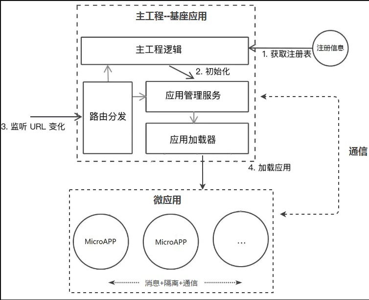

# 微前端初探

## 前言

这些年前端蓬勃发展，各自框架层出不穷，从最初的`Jquery`到`AngularJs`在到如今的`Vue`、`React`、`Angular`三分天下，每一次变化都是一次breaking change，新技术的发展为前端带来新的生机，也给前端工程师们带来困扰，如何在不修改旧有项目的基础上使用新的框架？如何管理越来越大的项目？如何缩短部署时间？如何进行增量部署。。。。

得益于微服务的广泛实践，微前端的概念顺势而出，具体来说微前端架构应该具备以下几个特性：

- 技术无关

主框架不限制接入应用的技术栈，由微应用本身决定

- 独立开发、独立部署、独立运行

微应用仓库独立，独立开发部署

## 实现方案

| 方案               | 描述                                                         | 优点                             | 缺点                                                         |
| ------------------ | ------------------------------------------------------------ | -------------------------------- | ------------------------------------------------------------ |
| Nginx路由转发      | 通过Nginx转发来管理不同应用，比如将`www.xxx.com/app1`映射到`app1`对应的项目中，`www.xxx.com/app2`映射到`app2`对应的项目中。 | 简单、快速、配置                 | 切换应用会导致浏览器刷新；应用直接通信复杂化                 |
| iframe             | 父应用下嵌套多个子`iframe`                                   | 实现简单、子应用自带沙箱         | [Why Not Iframe](https://www.yuque.com/kuitos/gky7yw/gesexv) |
| Web Components     | 子应用采用纯Web Components（ShadowDOM）技术编写              | 原生编写、沙箱隔离               | 浏览器支持有限，项目改造成本高                               |
| 组合式应用路由分发 | 子应用独立构建和部署，父应进行路由管理，应用加载，启动，卸载，以及通信机制 | 应用间切换体验好，子应用相互隔离 | 开发中需要解决样式冲突、js全局变量污染、应用间通信等问题     |

总体来看，方案间各有优点，可根据具体项目来选择。不过市面上现有的解决方案都比较推崇应用路由分发，比如[Single Spa](https://single-spa.js.org/)，[qiankun](https://qiankun.umijs.org/zh/guide#%E4%BB%8B%E7%BB%8D)等，本文也重点介绍`组合式应用路由分发`

## 组合式应用路由分发的实现要点

这一节简略介绍以下`组合式应用路由分发`的实现，该方案的基本流程如下：

图片来源: [微前端-最容易看懂的微前端知识](https://juejin.im/post/6844904162509979662)

从这张流程图中，我们可以得出以下实现要点：

- **子应用的注册和加载**

作为微前端的基座应用，子应用的注册、匹配和加载是首要工作，这一点可以参考[single-spa](https://github.com/single-spa/single-spa)

- **Js 隔离**

Js隔离是为了杜绝全局变量的污染，这可以通过对`window`对象做快照的方式进行处理（子应用加载前打个快照，子应用卸载后对快照进行恢复）,参考[qiankun sandbox的实现](https://github.com/umijs/qiankun/blob/v2.2.3/src/sandbox/index.ts#L39)

- **样式隔离**

防止样式冲突的方式一般有两种:

1. Module Css: 使用webpack的[`css-loader`](https://www.npmjs.com/package/css-loader)，设置`modules`为`true`即可

2. Css 命名空间: 为Css设置同一前缀

但是这两种方式都无法解决引入第三方样式库隔离的问题，这个可以参考[qiankun
](https://github.com/umijs/qiankun/blob/v2.2.3/src/sandbox/patchers/css.ts#L43)的实现，通过遍历子应用中所有的`CSSRule`，为其添加指定的前缀（比如子应用的名称）

- **应用间通信**

## 现有框架

- [Single-Spa](https://single-spa.js.org/)：最早的微前端框架，不过这套框架并没有实现js/css的隔离
- [qiankun](https://qiankun.umijs.org/zh/guide#%E4%BB%8B%E7%BB%8D):  基于Single-Spa，在此基础上实现了js/css的隔离等功能

## 其他关于微前端的文章
- [微前端在美团外卖的实践](https://tech.meituan.com/2020/02/27/meituan-waimai-micro-frontends-practice.html)
- [网易严选企业级微前端解决方案与落地实践](https://zhuanlan.zhihu.com/p/97226980)