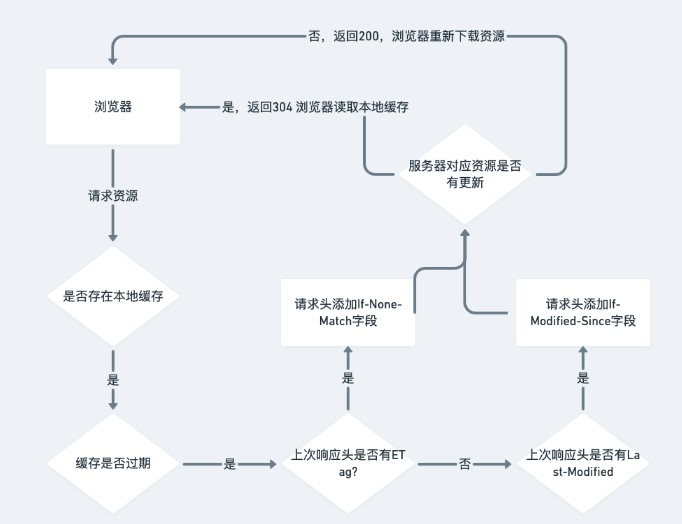
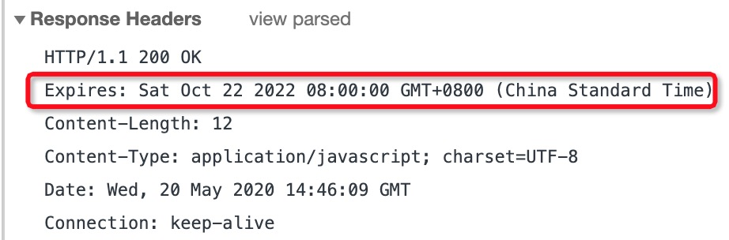
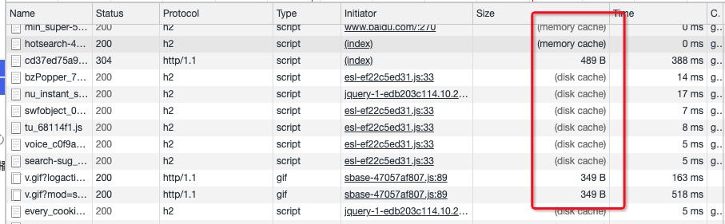

# Http 缓存

## 前言

虽然通信技术的发展，使我们能够更加方便快捷的获取内容，但不可否认的是，客户端与服务器之间进行多次往返通信造成的等待依旧会让我们感到不快。因此，通过合理利用缓存，可以有效减少资源响应时间，优化体验。

HTTP 缓存可以分为两种：强制缓存和协商缓存，整体流程图如下：

## 强制缓存

强制缓存就是本地缓存查找的过程，在这个阶段不需要发送请求到服务器。强制缓存由Expires、Cache-Control 和 Pragma 3 个 Header 属性共同来控制。

> 优先级: Pragma > Cache-Control > Expires

### `Pragma`

`Pragma`是一个在`HTTP/1.0`中规定的通用首部，它用来向后兼容只支持`HTTP/1.0`协议的缓存服务器，它只有一个属性值，就是`no-cache`，与 `Cache-Control: no-cache` 效果一致，即强制要求资源需要通过服务器进行有效性校验。

> ⚠️：建议只在需要兼容`HTTP/1.0`客户端的场合下应用 `Pragma`首部，本建议来自：[MDN](https://developer.mozilla.org/zh-CN/docs/Web/HTTP/Headers/Pragma)

### `Cache-Control`

`Cache-Control`是`HTTP/1.1`中新增的属性，可以被用在`Http`响应和请求头中，常用属性值如下：

- `no-store`: 所有内容都不会被缓存，即不使用强制缓存，也不使用协商缓存
- `no-cache`: 资源可以缓存在客户端，但是使用缓存前都要发送请求到服务器校验缓存的有效性，当缓存内容仍有效时可以跳过 HTTP响应体的下载，直接使用本地缓存。`Cache-Control: no-cache`和`Cache-Control: max-age=0`等效
- `public`: 表明响应可以被任何对象（包括：发送请求的客户端，代理服务器，等等）缓存
- `private`: 所有内容只有客户端可以缓存（比如可以缓存在浏览器，但不能在CDN上缓存），`Cache-Control`的默认取值
- `max-age`：设置缓存存储的最大周期（单位为秒），超过这个时间缓存被认为过期。即缓存内容将在xxx秒后失效。

### `Expires`

`Expires`是`HTTP/1.0`控制网页缓存的字段，当我们首次请求资源时，服务器会返回`Expires`头表示该资源的过期时间。与`Cache-Control`中的`max-age`不同的是，`Expires`返回的是绝对时间:

当再次请求该资源时，如果系统时间小于该过期时间，则直接使用缓存。但是如果系统时间与服务器时间不一致，则会造成资源更新时机与预期不一致的情况，所以到了HTTP/1.1，`Expires`已经被`Cache-Control`替代

> `Memory Cache` 和 `Disk Cache`的区别
> Chrome DevTools Network中，我们经常会发现`Size`列中存在两种缓存`Memory Cache`和`Disk Cache`
> 
> 这两种缓存都是强制缓存，不同的是`Memory Cache`存储在内存中，`Disk Cache`存放在硬盘中，一般情况下在没有关闭Tab，重复刷新同一个网址，我们会发现资源大部分存储在`Memory Cache`中，如果关闭Tab再重新打开网址，`Memory Cache`会被清空取而代之的是`Disk Cache`。

## 协商缓存

如果强制缓存失效，浏览器就会携带缓存标识向服务器发起请求，由服务器去判断是否使用缓存，这一过程就是协商缓存。协商缓存会产生两种结果：

1. 资源没发生改变，返回304，浏览器使用本地缓存
2. 资源过期，返回200，浏览器从服务器中下载资源

控制协商缓存的字段有：`Etag / If-None-Match`和`Last-Modified / If-Modified-Since`，其中`Etag / If-None-Match`的优先级比`Last-Modified / If-Modified-Since`高。

### `Etag / If-None-Match`

`ETag`由服务器生成并通过响应头传递给客户端，其值是一串hash码，是资源的标识符，当改资源发生变化时，其hash值也会随之发生改变。

而`If-None-Match`是客户端再次发起请求时，所携带的上一次请求返回的Etag值。当服务器收到该请求后，会对`If-None-Match`中的值与该资源在服务器中的`ETag`值进行比较，一致则返回304，否则返回200

### `Last-Modified / If-Modified-Since`

`Last-Modified`代表资源最后更新的时间。当资源被请求时，服务器会在响应头中携带该字段，再次对同一资源发起请求时，请求头会携带上一次响应头中的`Last-Modified`的时间，并放到 
`If-Modified-Since`请求头属性中，服务端根据文件最后一次修改时间和`If-Modified-Since`的值进行比较，如果相等，返回 304 ，否则返回200。

## Nginx中配置

## 参考

- [How do I stop Chrome sending Cache-control: max-age=0 when I hit enter?](https://superuser.com/questions/313131/how-do-i-stop-chrome-sending-cache-control-max-age-0-when-i-hit-enter)
- [ETag MDN](https://developer.mozilla.org/zh-CN/docs/Web/HTTP/Headers/ETag)
- [How do we control web page caching, across all browsers?](https://stackoverflow.com/questions/49547/how-do-we-control-web-page-caching-across-all-browsers)
- [彻底理解浏览器的缓存机制](https://juejin.im/entry/5ad86c16f265da505a77dca4)
- [图解http缓存](https://juejin.im/post/5eb7f811f265da7bbc7cc5bd)