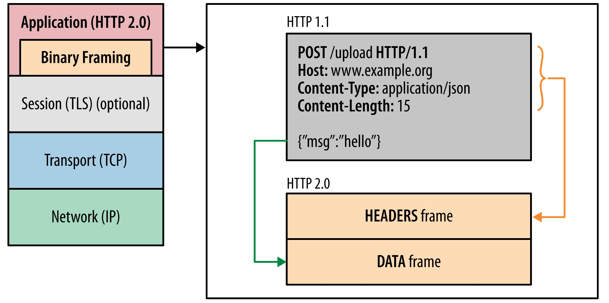
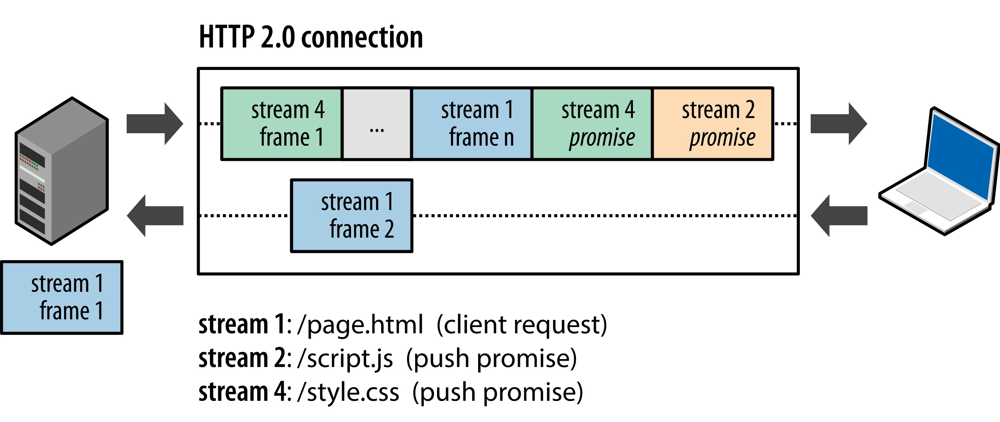

# HTTP/2 及 HTTP/3

## Http/1.x

HTTP1.x已经陪伴我们走过来十几个春秋，为互联网的蓬勃发展立下汗马功劳，但随着互联网应用需求的增多，HTTP1.x也显现了它的不足。

### Http/1.x的缺陷

1. <b>队头阻塞（Head-Of-Line Blocking）</b>: 队头阻塞是指当顺序发送的请求序列中的一个请求因为某种原因被阻塞时，在后面排队的所有请求也一并被阻塞，会导致客户端迟迟收不到数据。

2. <b>连接无法复用</b>: 连接无法复用会导致每次请求都经历三次握手和慢启动。三次握手在高延迟的场景下影响较明显，慢启动则在大量小文件请求影响较大（没有达到最大窗口请求就被终止）。

虽然在HTTP/1.1中默认开启了[Keep-Alive](https://developer.mozilla.org/zh-CN/docs/Web/HTTP/Connection_management_in_HTTP_1.x)机制，但是对于不同域名的资源仍然需要建立多个connection，耗费资源。

3. <b>过大的Http头</b>: 报文头无法压缩
4. <b>明文传输</b>: Http 1.x传输的内容都是明文的，这带来了安全隐患

### 基于Http/1.x的Web优化

针对Http/1.x的缺陷，人们尝试过以下办法来解决：

1. <b>Domain Sharding（域名分片）</b>：将同一页面的资源分散到不同域名下，提高浏览器并发请求的能力。一般浏览器会为每个域名建立多个连接（Chrome是6个），以实现并发请求，域名分片在于提升浏览器创建的连接数，从而提高请求效率。

2. <b>内联资源（Inline resource）</b>：内联资源可以减少请求，常见的是把较小的图片转换成`base64`。

3. <b>合并文件（Concatenation）</b>：合并文件（把多个css/js文件合并到一个文件中）同样是为了减少资源的请求。

4. <b>雪碧图（Spriting）</b>：很多较小的图片合并成一张大图，再用css定位到具体的图片。

## Http/2

Http/1.x存在天然的缺陷，无论如何优化都是治标不治本，直到Http/2的诞生才真正实现对协议本身的改造。Http/2并不是对Http/1.x的重写，它可以完全兼容HTTP/1.x。

### Http/2的新特性

1. 新的二进制格式（Binary Format）

HTTP/2采用新的二进制分帧层，它定义了如何封装HTTP消息并在客户端与服务器之间传输。



Http/1.x的解析是基于文本，而HTTP/2将所有传输的信息分割为更小的消息和帧，并采用二进制格式对它们编码。

2. Header压缩

Http1.x的header由于cookie和user agent很容易膨胀，而且每次都要重复发送。

HTTP/2开发了专门的"HPACK”算法，压缩header，减少发送包的数量从而降低延迟。

3. 多路复用

在HTTP/1.x中，如果客户端要想发起多个并行请求以提升性能，则必须使用多个TCP连接。而HTTP/2突破了这些限制，实现了多个请求共用同一个TCP连接。

4. 服务端推送

HTTP/2 新增的另一个强大的新功能是，服务器可以对一个客户端请求发送多个响应。



假设浏览器请求加载页面`page.html`，`page.html`需要依赖`script.js`和`style.css`这两种资源。

传统上，服务器收到`page.html`的请求，只会发送单一资源给浏览器，等到浏览器解析到需要`script.js`和`style.css`再像服务器要。

服务端推送在收到`page.html`的请求，就会连同`script.js`和`style.css`也一起推送给浏览器。

另外需要补充的是,服务端可以主动推送，客户端也有权利选择是否接收。如果服务端推送的资源已经被浏览器缓存过，浏览器可以通过发送RST_STREAM帧来拒收。主动推送也遵守同源策略，换句话说，服务器不能随便将第三方资源推送给客户端，而必须是经过双方确认才行。

### 基于Http/2的Web优化

尽管HTTP/2相比HTTP/1.x有很大的不同，但有几条优化规则是仍然适用的：

- 减少DNS查询。DNS查询需要时间，没有resolved的域名会阻塞请求。
- 减少TCP连接。
- 使用CDN。使用CDN分发资源可以减少延迟。
- 减少HTTP跳转。特别是非同一域名的跳转，需要DNS，TCP，HTTP三种开销。
- 消除不必要的请求数据。
- 压缩传输的数据。gzip压缩很高效。
- 客户端缓存资源。缓存是必要的。
- 消除不必要的资源。激进的提前获取资源对客户端和服务端都开销巨大。

### 开启Http/2

#### 在Nginx中启用

在Nginx中启用Http/2必须满足以下条件：

1. Nginx版本在1.9.5及以上
2. OpenSSL版本在1.0.2及以上，使用`openssl version`查看
3. 拥有SSL证书

满足以上条件后，修改对应配置即可

```bash
server {

  listen 443 ssl http2;
  listen [::]:443 ssl http2;

  server_name example.com;
  root /path/to/public;

  ssl_certificate /path/to/certificate.crt;
  ssl_certificate_key /path/to/private.key;
  .....
}
```

## Http/3

> 截止到2020年9月，Http3依旧处于草案状态，不过Chrome、Firefox已经支持（默认处于禁用）

虽然Http/2解决了很多先前遗留下的问题，但由于Http/2依旧依赖`TCP`协议，也因此造成了一些问题：

1. TCP 以及 TCP+TLS 建立连接的延时
2. TCP的队头阻塞

Http/3使用“QUIC”协议解决了以上问题

## 参考

- [HTTP2简介和基于HTTP2的Web优化](https://github.com/creeperyang/blog/issues/23)
- [HTTP/2 简介](https://developers.google.com/web/fundamentals/performance/http2?hl=zh-cn)
- [解读HTTP/2 及 HTTP/3特性](https://github.com/ljianshu/Blog/issues/57)
- [HTTP/2 Speed Compare](https://http2.akamai.com/demo)
- [科普：QUIC协议原理分析](https://zhuanlan.zhihu.com/p/32553477)